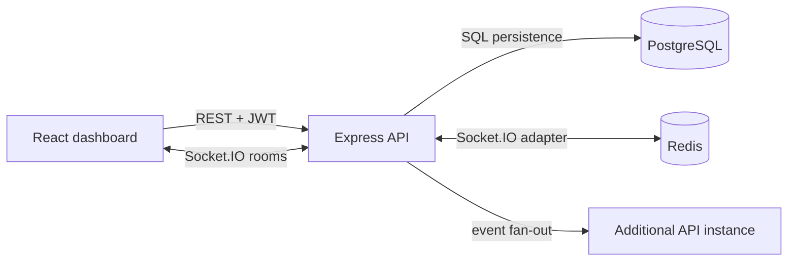

# CollabFlow — Real-Time Collaborative Project Management

> A production-minded collaboration system built to demonstrate **real-time full-stack engineering**, **role-based access control**, and **scalable event delivery**.

CollabFlow is a React and Node.js workspace for teams that need task boards, auditable activity, and instant state synchronization. The application ships as a self-contained Docker Compose environment with a React interface, an Express and Socket.IO API, PostgreSQL for durable state, and Redis for cross-instance event fan-out.

## Why this project is interview-ready

| Capability | Implementation evidence |
| --- | --- |
| **Real-time communication** | Authenticated Socket.IO connections join isolated workspace rooms and receive `task:updated` and presence events. |
| **Role-based authorization** | Workspace membership supports `owner`, `admin`, `member`, and `viewer`; task writes are enforced at the API layer. |
| **Conflict-aware collaboration** | Task writes require an expected version. A stale update receives `409 VERSION_CONFLICT` instead of overwriting a teammate’s change. |
| **Scalable backend design** | The Socket.IO Redis adapter propagates events across API instances; PostgreSQL remains the durable system of record. |
| **Repeatable operations** | Docker Compose starts the web app, API, PostgreSQL, and Redis with health checks and seeded demonstration data. |

## Architecture



The Docker Compose profile uses the persistent PostgreSQL and Redis path. The non-container `pnpm dev` path intentionally uses an in-memory demonstration repository so the UI can be explored without infrastructure; this is called out clearly in the configuration.

## Run it locally

### Option 1: complete stack with Docker Compose

```bash
git clone https://github.com/AYANOKOJI-71/collabflow-realtime-pm.git
cd collabflow-realtime-pm
docker compose up --build
```

Open `http://localhost:5173`. The API is available at `http://localhost:4000`, with `GET /healthz` and `GET /readyz` for operational checks. Stop and remove the local state with:

```bash
docker compose down -v
```

### Option 2: fast UI/API demonstration mode

```bash
corepack enable
pnpm install
cp .env.example .env
pnpm dev
```

The default `.env.example` has `DEMO_MODE=true`, which intentionally uses the in-memory repository. For the real PostgreSQL and Redis path, use Docker Compose or provide managed-service URLs with `DEMO_MODE=false`.

## Demonstration flow

The seeded **Cyber Invasion Army** workspace contains three role-aware users and four tasks. Open two browser tabs, click any task card in one tab to advance it, and observe the `task:updated` event appear in the other tab. The version displayed on each card changes with every successful update.

| Role | Intended permissions |
| --- | --- |
| Owner | Manages the workspace and all project/task operations. |
| Admin | Manages projects and tasks. |
| Member | Updates permitted tasks and reads activity. |
| Viewer | Reads workspace activity without task-write access. |

## API surface

| Method | Route | Purpose |
| --- | --- | --- |
| `POST` | `/api/demo/login` | Issues a time-limited token for a seeded demonstration user. This route is **demo-only**. |
| `GET` | `/api/me/workspaces` | Returns workspaces available to the authenticated user. |
| `GET` | `/api/workspaces/:workspaceId/dashboard` | Returns role-scoped workspace data. |
| `PATCH` | `/api/tasks/:taskId` | Updates a task using `expectedVersion` optimistic concurrency. |
| `GET` | `/healthz`, `/readyz` | Liveness and readiness endpoints. |

## Quality checks

```bash
pnpm lint
pnpm test
pnpm build
docker compose config
```

The test suite covers unauthenticated health access, member-scoped workspace retrieval, authorized task updates, and stale-write rejection.

## Security and production notes

The Compose credentials and seeded people are local demonstration data only. Do not deploy them as-is. Before production, replace demo login with a real identity provider, load `JWT_SECRET` and service URLs from a secret manager, apply TLS at an ingress or reverse proxy, use managed PostgreSQL backups, and restrict Redis network access. The containers run as non-root where applicable, and the API validates request bodies with Zod before state changes. See [SECURITY.md](SECURITY.md) for the responsible-disclosure and deployment guidance.

## Project structure

```text
apps/api/          Express, Socket.IO, RBAC, repository adapters, and tests
apps/web/          React dashboard and real-time client
database/          Versioned schema and reproducible demo seed data
compose.yaml       Full local stack and health checks
docs/              Architecture and operations notes
```

## License

This project is available under the [MIT License](LICENSE).
